# Introduction

This webbook contains all the code used for data analysis in study of gut microbiomes of newts across ponds included in a restoration plan.

## Prepare the R environment

### Environment

To reproduce all the analyses locally, clone this repository in your computer using:

```
RStudio > New Project > Version Control > Git
```

And indicating the following git repository:

> https://github.com/alberdilab/pig_stress_hologenomics.git

Once the R project has been created, follow the instructions and code chunks shown in this webbook.

### Libraries

The following R packages are required for the data analysis.


```{.r .script-source}
# Base
library(R.utils)
library(knitr)
library(tidyverse)
library(devtools)
library(tinytable)
library(rairtable)
library(janitor)
library(broom)
library(purrr)
library(dplyr)
library(tibble)
library(ggplot2)
library(BiocManager)
library(SummarizedExperiment)
library(edgeR)
library(limma)
library(DESeq2)
library(VennDiagram)
library(grid)
```

# Differential Expression Analyses

## Pre-processing of data

### Adapt the format

Define a function that reads and processes RNASeq input files, adapting the format to produce matrices containing only integer count values, with genes as rows and samples as columns (without annotation columns).


```{.r .script-source}
read_and_adapt <- function(file_path) {
  counts <- read_tsv(file_path, col_names = TRUE)
  counts_matrix <- counts %>%
    select(-gene_name) %>%
    column_to_rownames(var = "gene_id") %>%
    as.matrix()
  mode(counts_matrix) <- "numeric"
  return(counts_matrix)
}
```

Apply the function to all the tissues (amygdala, cortex, hyppocampus and liver).


```{.r .script-source}
amygdala_counts <- read_and_adapt("RNASeq_tables/RNASeq_out_Amigdala/salmon.merged.gene_counts.tsv")
cortex_counts <- read_and_adapt("RNASeq_tables/RNASeq_out_Cortex/salmon.merged.gene_counts.tsv")
hippocampus_counts <- read_and_adapt("RNASeq_tables/RNASeq_out_Hippocampus/salmon.merged.gene_counts.tsv")
liver_counts <- read_and_adapt("RNASeq_tables/RNASeq_out_Liver/salmon.merged.gene_counts.tsv")

#Save for later use
write.table(amygdala_counts, file = "differential_analysis/amygdala_counts.tsv", sep = "\t", quote = FALSE, row.names = TRUE)
```

Example of the amygdala count matrix (first 6 rows, first 5 columns):


Table: (\#tab:amygdala_input)First rows and columns of the amygdala count matrix

|                   | A10|  A11|  A12|  A13|  A14|
|:------------------|---:|----:|----:|----:|----:|
|ENSSSCG00000000002 |   6|    5|   44|   59|   22|
|ENSSSCG00000000003 | 481|  476|  473|  474|  517|
|ENSSSCG00000000005 | 541|  666|  617|  693|  667|
|ENSSSCG00000000006 | 228|  413|  310|  268|  449|
|ENSSSCG00000000007 | 301|  467|  348|  347|  409|
|ENSSSCG00000000010 | 749| 1192| 1154| 1825| 1080|


### Filter low-expressed genes

Keep genes with CPM values greater than one in at least two samples. The CPM value is used instead of the read count to eliminate the deviation caused by different sequencing depths.


```{.r .script-source}
filter_CPM <- function(counts_matrix, min_cpm = 1, min_samples = 2){
  cpm_values <- cpm(counts_matrix)
  keep <- rowSums(cpm_values > min_cpm) >= min_samples
  filtered_matrix <- counts_matrix[keep, , drop=FALSE]
  return(filtered_matrix)
}
```

Apply the function to all the tissues (amygdala, cortex, hyppocampus and liver).


```{.r .script-source}
amygdala_counts_f <- filter_CPM(amygdala_counts)
cortex_counts_f   <- filter_CPM(cortex_counts)
hippocampus_counts_f <- filter_CPM(hippocampus_counts)
liver_counts_f    <- filter_CPM(liver_counts)

# Save for later use
saveRDS(amygdala_counts_f, "differential_analysis/limma_voom/amygdala_counts_f.rds")
saveRDS(cortex_counts_f, "differential_analysis/limma_voom/cortex_counts_f.rds")
saveRDS(hippocampus_counts_f, "differential_analysis/limma_voom/hippocampus_counts_f.rds")
saveRDS(liver_counts_f, "differential_analysis/limma_voom/liver_counts_f.rds")
```

## Import sample metadata

Import all the sample information regarding treatment condition and sex for all tissues.


```{.r .script-source}
# Read metadata
metadata_amygdala <- read.table("metadata/metadata_amygdala.txt", header = TRUE)
metadata_cortex <- read.table("metadata/metadata_cortex.txt", header = TRUE)
metadata_hippocampus <- read.table("metadata/metadata_hippocampus.txt", header = TRUE)
metadata_liver <- read.table("metadata/metadata_liver.txt", header = TRUE)

# Make sure sample order is the same in data and metadata
metadata_liver <- metadata_liver[
  match(colnames(liver_counts), metadata_liver$sample),
]
```
Example of metadata for amygdala samples.


Table: (\#tab:amygdala_metadata)First rows of amygdala metadata

|sample |tissue   |condition |sex | Code_Xavi|Day_sacrif |ID_code |  ID|
|:------|:--------|:---------|:---|---------:|:----------|:-------|---:|
|A10    |Amygdala |control   |F   |         8|Oct10      |F850    | 946|
|A11    |Amygdala |control   |M   |         9|Oct10      |M997    | 991|
|A12    |Amygdala |control   |M   |        10|Oct10      |M329    | 993|
|A13    |Amygdala |control   |F   |        11|Oct10      |F830    | 987|
|A14    |Amygdala |control   |F   |        12|Oct10      |F825    | 990|
|A15    |Amygdala |control   |F   |        13|Oct10      |F4936   | 988|

Group data and metadata into lists for later use.


```{.r .script-source}
# Group data and metadata into lists for later use
counts_list <- list(amygdala = amygdala_counts_f, cortex = cortex_counts_f, hippocampus = hippocampus_counts_f, liver = liver_counts_f)
metadata_list <-list(amygdala = metadata_amygdala, cortex = metadata_cortex, hippocampus = metadata_hippocampus, liver = metadata_liver)
```


## Limma voom

### Methodology

First, we create a function to apply Limma‑voom analysis to all tissues. In this function, the first step is to create a design matrix specific for Limma‑voom analysis using a group vector. Then we create a DGEList object and normalise the data by the TMM method. Next, we apply voom, which transforms the count data to log‑counts per million (logCPM) and computes observation‑level weights to account for the mean‑variance relationship typical of RNA‑seq data. After voom, we fit a linear model using lmFit and then apply empirical Bayes moderation with eBayes to obtain moderated t‑statistics, p‑values and false discovery rates (FDR). The function then extracts the results table for the contrast of interest (stress vs. control) using topTable. Based on user‑defined thresholds (log₂FC > 2, FDR < 0.05), it classifies each gene as up‑regulated, down‑regulated or not significant. Finally, the function returns a list containing the results table, the DGEList object, the voom object, the design matrix and a summary of the number of differentially expressed genes.


```{.r .script-source}
run_limma_voom <- function(counts_matrix, metadata, group_col = "condition", covariates = c("sex"), logFC_thresh = 2, pval_thresh = 0.05) {

  # Create group (factor) using condition column
  group <- factor(metadata[[group_col]], levels = c("control", "stress"))
  
  # Build the design formula including group and covariables
  design_formula <- as.formula(paste("~", group_col, "+", paste0(covariates, collapse = "+")))
  design <- model.matrix(design_formula, data = metadata)
  rownames(design) <- metadata$sample
  
  # Create DGEList and normalise it by TMM method
  dge <- DGEList(counts = counts_matrix, group = group)
  dge <- calcNormFactors(dge, method = "TMM")
  
  # Apply voom
  v <- voom(dge, design, plot = FALSE)
  
  # Adjust the linear model
  fit <- lmFit(v, design)
  fit <- eBayes(fit)
  
  # Extract result table
  res <- topTable(fit, coef = "conditionstress", n = Inf, sort.by = "none")
  
  # Create significance column based on thresholds
  res$sig <- factor(
    ifelse(res$adj.P.Val < pval_thresh & abs(res$logFC) > logFC_thresh,
           ifelse(res$logFC > logFC_thresh, "up", "down"),
           "not"),
    levels = c("up", "down", "not")
  )
  
  # Summary of DEGs
  deg_summary <- summary(res$sig)
  
  # Results
  return(list(results = res, dge = dge, v = v, design = design, deg_summary = deg_summary))
}
```

Apply the function to all the tissues (amygdala, cortex, hyppocampus and liver).


```{.r .script-source}
#Apply the function to each pair of data and metadata
limma_results <- map2(counts_list, metadata_list, ~ run_limma_voom(counts_matrix = .x, metadata = .y))

#Save result tables
walk2(limma_results, names(limma_results), ~ write.csv(.x$results, file = file.path("differential_analysis/limma_voom", paste0("result_limma_voom_", .y, ".csv")), row.names = TRUE))
```
### Results

The following tables show the first few lines of the results for each tissue (genes with logFC, p-values, etc.). Full tables are available in the differential_analysis/limma_voom/ folder.

#### Amygdala

Top 6 rows of limma-voom results for amygdala. 

Table: (\#tab:limma_voom_amygdala)Limma‑voom results for amygdala (top 6 rows)

|                   |      logFC|   AveExpr|          t|   P.Value| adj.P.Val|         B|sig |
|:------------------|----------:|---------:|----------:|---------:|---------:|---------:|:---|
|ENSSSCG00000000002 |  0.1272223| -1.720627|  0.4688020| 0.6411920| 0.8646184| -4.815137|not |
|ENSSSCG00000000003 |  0.1471246|  3.441317|  1.9250392| 0.0597626| 0.3621335| -4.114587|not |
|ENSSSCG00000000005 |  0.0311047|  3.624529|  0.4917307| 0.6250017| 0.8570678| -5.666735|not |
|ENSSSCG00000000006 | -0.0068489|  2.696342| -0.0739173| 0.9413629| 0.9817962| -5.628632|not |
|ENSSSCG00000000007 |  0.0700214|  3.040492|  0.6960261| 0.4895456| 0.7909370| -5.472915|not |
|ENSSSCG00000000010 |  0.0126956|  4.677031|  0.0960375| 0.9238640| 0.9755966| -5.872082|not |
Summary of DEGs in amygdala (up/down/not):


``` script-output

  not 
16196 
```
#### Cortex

Top 6 rows of limma-voom results for cortex. 

Table: (\#tab:limma_voom_cortex)Limma‑voom results for cortex (top 6 rows)

|                   |      logFC|  AveExpr|          t|   P.Value| adj.P.Val|         B|sig |
|:------------------|----------:|--------:|----------:|---------:|---------:|---------:|:---|
|ENSSSCG00000000003 |  0.0158026| 3.267039|  0.1867906| 0.8525458| 0.9298206| -5.909755|not |
|ENSSSCG00000000005 | -0.1503963| 3.638338| -2.0207378| 0.0484278| 0.2260110| -4.110167|not |
|ENSSSCG00000000006 | -0.0335232| 2.683880| -0.2923176| 0.7711975| 0.8858632| -5.780618|not |
|ENSSSCG00000000007 | -0.0631811| 3.329472| -0.7951129| 0.4301329| 0.6661372| -5.638570|not |
|ENSSSCG00000000010 | -0.4141370| 5.146826| -1.7194817| 0.0914261| 0.3068071| -4.735873|not |
|ENSSSCG00000000014 |  0.1002355| 3.733248|  1.5714403| 0.1220967| 0.3561970| -4.844817|not |

Summary of DEGs in cortex (up/down/not):


``` script-output

 down   not 
    1 15986 
```
#### Hippocampus

Top 6 rows of limma-voom results for hippocampus. 


Table: (\#tab:limma_voom_hippocampus)Limma‑voom results for hippocampus (top 6 rows)

|                   |      logFC|  AveExpr|          t|   P.Value| adj.P.Val|         B|sig |
|:------------------|----------:|--------:|----------:|---------:|---------:|---------:|:---|
|ENSSSCG00000000003 |  0.1490716| 3.372600|  2.0723106| 0.0432079| 0.1152114| -4.357393|not |
|ENSSSCG00000000005 | -0.0470691| 3.654761| -0.5897833| 0.5578883| 0.6860923| -6.268605|not |
|ENSSSCG00000000006 | -0.2591378| 2.540821| -1.8905322| 0.0642612| 0.1510190| -4.563778|not |
|ENSSSCG00000000007 | -0.1970656| 3.114347| -2.1530055| 0.0359746| 0.1018307| -4.166996|not |
|ENSSSCG00000000010 | -0.4180822| 4.979186| -2.0716377| 0.0432731| 0.1153451| -4.500896|not |
|ENSSSCG00000000014 | -0.0036010| 3.566223| -0.0507714| 0.9597021| 0.9769166| -6.427767|not |

Summary of DEGs in hippocampus (up/down/not):


``` script-output

 down   not    up 
   51 15965    28 
```

#### Liver

Top 6 rows of limma-voom results for liver. 


Table: (\#tab:limma_voom_liver)Limma‑voom results for liver (top 6 rows)

|                   |      logFC|   AveExpr|          t|   P.Value| adj.P.Val|         B|sig |
|:------------------|----------:|---------:|----------:|---------:|---------:|---------:|:---|
|ENSSSCG00000000003 |  0.5283572| 6.2095058|  5.0514294| 0.0000054| 0.0001118|  3.823475|not |
|ENSSSCG00000000005 |  0.8546173| 6.0164992|  4.9550395| 0.0000076| 0.0001426|  3.493476|not |
|ENSSSCG00000000006 |  1.1894580| 4.3657484|  5.1540402| 0.0000038| 0.0000854|  4.151317|not |
|ENSSSCG00000000007 |  0.1605117| 2.6281456|  1.6179670| 0.1115530| 0.2097834| -5.160816|not |
|ENSSSCG00000000010 | -0.1217155| 7.6243238| -1.2215405| 0.2272387| 0.3570506| -5.706670|not |
|ENSSSCG00000000014 | -0.0140391| 0.8048311| -0.1286167| 0.8981434| 0.9356727| -6.033441|not |

Summary of DEGs in liver (up/down/not):


``` script-output

 down   not    up 
    4 13143    17 
```


### Volcano plots

Create volcano plots for each tissue using the volcano_plot function (thresholds: log₂FC > 2, FDR < 0.05). The plots are saved as PNG and PDF in differential_analysis/limma_voom/volcano_plots/. They are displayed below.


```{.r .script-source}
# Volcano plot function
volcano_plot <- function(data, thre_logFC = 2, thre_pval = 0.05) {
  data$color <- as.character(
    ifelse(data$adj.P.Val < thre_pval & abs(data$logFC) > thre_logFC,
           ifelse(data$logFC > thre_logFC, 'red', 'green'),
           'grey'))
  
  p <- ggplot(data, aes(x = logFC, y = -log10(adj.P.Val))) +
    geom_point(size = 0.25, colour = data$color) +
    theme_bw() +
    geom_hline(yintercept = -log10(thre_pval), colour = "black", linetype = "dashed") +
    geom_vline(xintercept = -thre_logFC, colour = "black", linetype = "dashed") +
    geom_vline(xintercept = thre_logFC, colour = "black", linetype = "dashed") +
    theme(axis.text.y = element_text(size = 10, face = "plain"),
          axis.title.y = element_text(size = 10, face = "bold"),
          panel.border = element_blank(),
          axis.line = element_line(colour = "black", size = 0.8),
          legend.position = "none",
          panel.grid.major = element_blank(),
          panel.grid.minor = element_blank(),
          panel.background = element_rect(fill = "white")) +
    ylab("-log10(adj.P.Val)") +
    xlab("log2FC")
  
  return(p)
}
```

Apply the function to all the tissues and save the plots.


```{.r .script-source}
#Define output directory
output_dir <- "differential_analysis/limma_voom"
volcano_dir <- file.path(output_dir, "volcano_plots")
if (!dir.exists(volcano_dir)) dir.create(volcano_dir, recursive = TRUE)

# Iterate over the results and save each volcano plot
walk2(limma_results, names(limma_results), function(res, tissue) {
  # Extract results
  df <- res$results
  # Generate plot
  p <- volcano_plot(df, thre_logFC = 2, thre_pval = 0.05)
  # Save as png
  ggsave(filename = file.path(volcano_dir, paste0("volcano_", tissue, ".png")),
         plot = p, width = 6, height = 5, dpi = 300)
  # Save as pdf
  ggsave(filename = file.path(volcano_dir, paste0("volcano_", tissue, ".pdf")),
         plot = p, width = 6, height = 5)
})
```


**Amygdala**

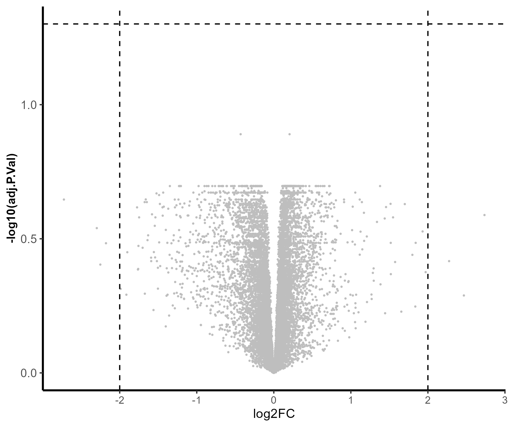


**Cortex**

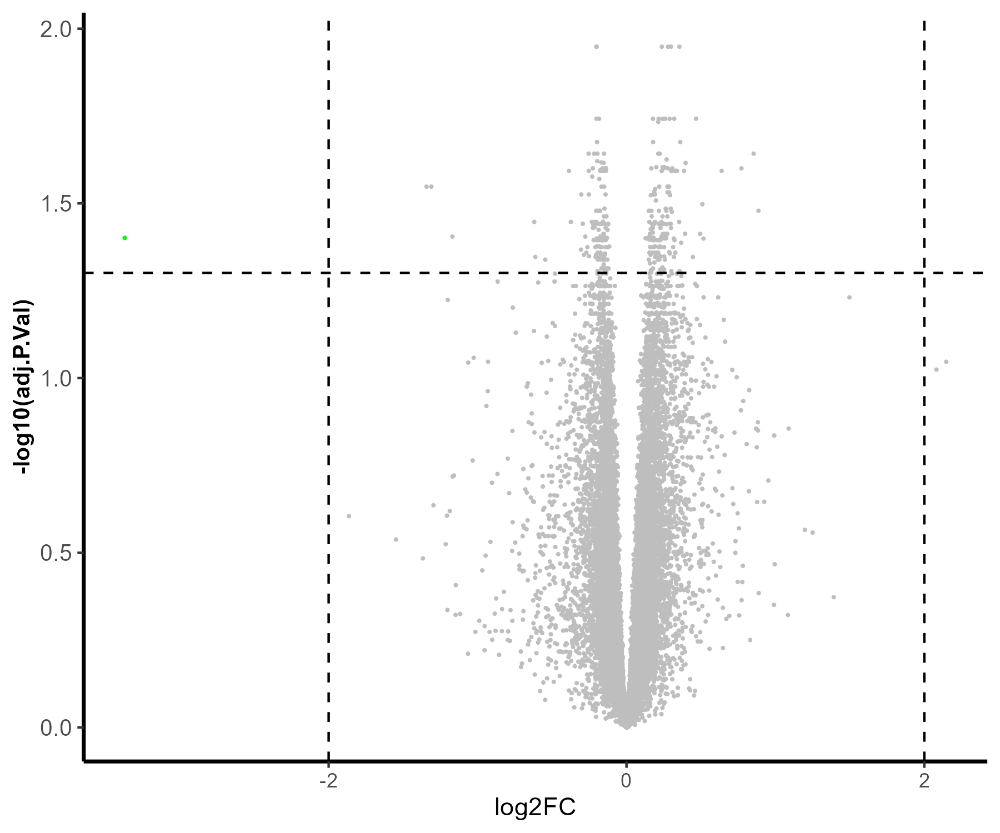


**Hippocampus**

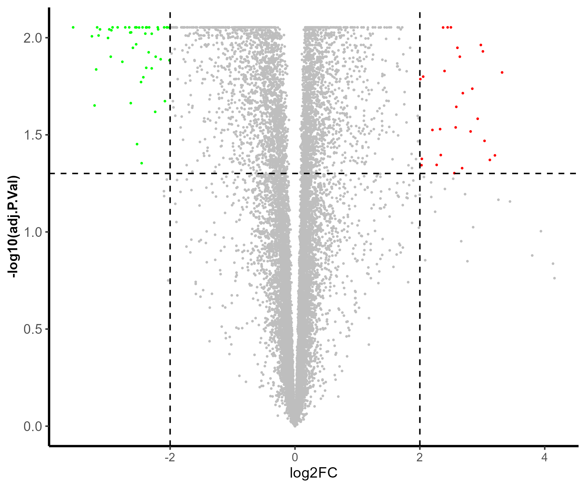


**Liver**

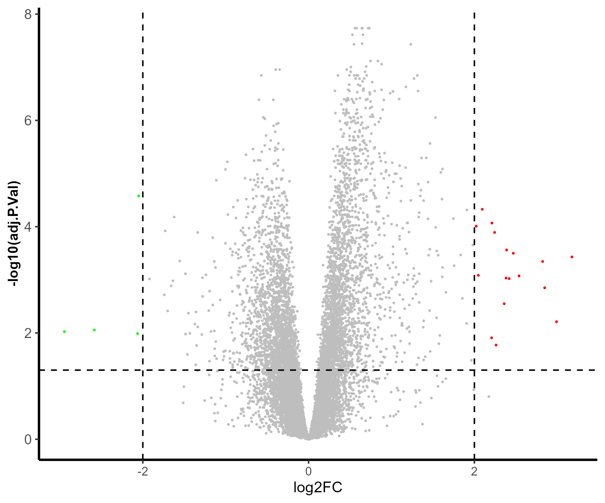

## EdgeR

### Methodology

This code implements a function in R to perform differential expression analysis using edgeR. Unlike limma-voom, which transforms count data for linear modeling, edgeR directly models raw count data using negative binomial generalized linear models. The function takes a count matrix and a metadata table as input, builds a design matrix including covariates (such as sex), fits the statistical model, and returns a table of differentially expressed genes between groups of interest, correcting for the specified covariates.


```{.r .script-source}
run_edgeR <- function(counts_matrix, metadata, group_col = "condition", covariates = c("sex"), logFC_thresh = 2, pval_thresh = 0.05) {
  # Ensure that the order of the columns in `counts_matrix` matches that in `metadata$sample
  counts_matrix <- counts_matrix[, metadata$sample]
  
  # Create the group vector
  group <- factor(metadata[[group_col]], levels = c("control", "stress"))
  
  # Build the design matrix using covariates
  design_formula <- as.formula(paste("~", group_col, "+", paste0(covariates, collapse = "+")))
  design <- model.matrix(design_formula, data = metadata)
  rownames(design) <- metadata$sample
  
  # Create the DGEList object and normalise it using TMM method
  dge <- DGEList(counts = counts_matrix, group = group)
  dge <- calcNormFactors(dge, method = "TMM")
  
  # Estimate the dispersion
  dge <- estimateDisp(dge, design, robust = TRUE)
  
  # Fits the generalised linear model (GLM) and performs the quasi-likelihood F-test
  fit <- glmQLFit(dge, design)
  qlf <- glmQLFTest(fit, coef = "conditionstress")
  
  # Extract the results table
  res <- topTags(qlf, n = Inf)$table
  
  # Create a significance column based on thresholds
  res$sig <- factor(
    ifelse(res$FDR < pval_thresh & abs(res$logFC) > logFC_thresh,
           ifelse(res$logFC > logFC_thresh, "up", "down"),
           "not"),
    levels = c("up", "down", "not")
  )
  
  # Summary of DEGs
  deg_summary <- summary(res$sig)
  
  
  # Results
  return(list(results = res, dge = dge, fit = fit, design = design, deg_summary = deg_summary))
}
```

Apply the function to all the tissues (amygdala, cortex, hyppocampus and liver).


```{.r .script-source}
# Apply the edgeR function to each pair
edgeR_results <- map2(counts_list, metadata_list, ~ run_edgeR(counts_matrix = .x, metadata = .y))

# Save result tables
walk2(edgeR_results, names(edgeR_results), ~ 
  write.csv(.x$results, file = file.path("differential_analysis/edgeR", paste0("result_edgeR_", .y, ".csv")), row.names = TRUE)
)
```

### Results

The following tables show the first few lines of the results for each tissue (genes with logFC, p-values, etc.). Full tables are available in the differential_analysis/edgeR/ folder.

#### Amygdala

Top 6 rows of edgeR results for amygdala:


Table: (\#tab:edgeR_amygdala)edgeR results for amygdala (top 6 rows)

|                   |    logFC|    logCPM|        F|  PValue|       FDR|sig |
|:------------------|--------:|---------:|--------:|-------:|---------:|:---|
|ENSSSCG00000008011 | 3.578722| -1.116083| 27.94790| 1.3e-06| 0.0136809|up  |
|ENSSSCG00000012346 | 3.439099| -2.345614| 26.05372| 1.8e-06| 0.0136809|up  |
|ENSSSCG00000054680 | 3.203517| -2.094333| 25.28025| 2.5e-06| 0.0136809|up  |
|ENSSSCG00000001483 | 2.943937| -1.753810| 24.74153| 3.8e-06| 0.0152573|up  |
|ENSSSCG00000039413 | 2.748904| -1.233918| 23.57103| 7.4e-06| 0.0238941|up  |
|ENSSSCG00000009665 | 3.106066|  1.329164| 24.36399| 9.0e-06| 0.0242851|up  |

Summary of DEGs in amygdala (up/down/not):

``` script-output

  not    up 
16183    13 
```
#### Cortex

Top 6 rows of edgeR results for cortex:


Table: (\#tab:edgeR_cortex)edgeR results for cortex (top 6 rows)

|                   |      logFC|   logCPM|        F|  PValue|       FDR|sig |
|:------------------|----------:|--------:|--------:|-------:|---------:|:---|
|ENSSSCG00000000932 |  5.1358420| 1.700749| 33.96057| 2.0e-07| 0.0038276|up  |
|ENSSSCG00000002729 | -0.2021708| 5.536446| 28.17967| 2.3e-06| 0.0144869|not |
|ENSSSCG00000005904 | -0.2019873| 6.684174| 27.24570| 3.1e-06| 0.0144869|not |
|ENSSSCG00000025293 |  0.2321773| 5.943974| 26.02142| 4.8e-06| 0.0144869|not |
|ENSSSCG00000015048 |  4.3451482| 2.092224| 24.56285| 5.0e-06| 0.0144869|up  |
|ENSSSCG00000024413 | -0.2047066| 8.944727| 25.59156| 5.5e-06| 0.0144869|not |

Summary of DEGs in cortex (up/down/not):

``` script-output

 down   not    up 
    7 15973     7 
```

#### Hippocampus

Top 6 rows of edgeR results for hippocampus:


Table: (\#tab:edgeR_hippocampus)edgeR results for hippocampus (top 6 rows)

|                   |    logFC|     logCPM|        F| PValue|       FDR|sig |
|:------------------|--------:|----------:|--------:|------:|---------:|:---|
|ENSSSCG00000021018 | 3.594479| -0.1780427| 35.63069|  2e-07| 0.0008321|up  |
|ENSSSCG00000034102 | 1.931049|  5.3105377| 35.80301|  2e-07| 0.0008321|not |
|ENSSSCG00000014124 | 2.863863|  4.1445362| 35.65344|  2e-07| 0.0008321|up  |
|ENSSSCG00000055661 | 3.176130|  1.3597646| 35.16443|  3e-07| 0.0008321|up  |
|ENSSSCG00000003778 | 3.758276| -1.0977240| 31.18360|  3e-07| 0.0008321|up  |
|ENSSSCG00000017909 | 2.687305|  2.2701125| 34.46075|  3e-07| 0.0008321|up  |

Summary of DEGs in hippocampus (up/down/not):

``` script-output

 down   not    up 
    2 15934   108 
```


#### Liver

Top 6 rows of edgeR results for liver:


Table: (\#tab:edgeR_liver)edgeR results for liver(top 6 rows)

|                   |     logFC|   logCPM|        F| PValue| FDR|sig |
|:------------------|---------:|--------:|--------:|------:|---:|:---|
|ENSSSCG00000001424 | 0.5619546| 4.367224| 78.02654|      0|   0|not |
|ENSSSCG00000017882 | 0.6987771| 6.106816| 76.94772|      0|   0|not |
|ENSSSCG00000021289 | 0.5652605| 4.862521| 76.56571|      0|   0|not |
|ENSSSCG00000040624 | 0.6443372| 3.535575| 76.45935|      0|   0|not |
|ENSSSCG00000001409 | 0.7205550| 5.880420| 75.79880|      0|   0|not |
|ENSSSCG00000013900 | 0.7083329| 4.101120| 71.49054|      0|   0|not |

Summary of DEGs in liver (up/down/not):


``` script-output

 down   not    up 
    3 13153     8 
```

### Volcano plots

The following volcano plots were generated for each tissue using the same volcano_plot function as for the limma-voom analysis. The function is applied to the edgeR results, with the same thresholds (log₂FC > 2, FDR < 0.05). Plots are saved as PNG and PDF files in differential_analysis/edgeR/volcano_plots/, and are displayed below.

Apply the function to all the tissues and save the plots.


```{.r .script-source}
# Define output directory for edgeR volcano plots
output_dir <- "differential_analysis/edgeR"
volcano_dir <- file.path(output_dir, "volcano_plots")
if (!dir.exists(volcano_dir)) dir.create(volcano_dir, recursive = TRUE)

# Iterate over the edgeR results and save each volcano plot
walk2(edgeR_results, names(edgeR_results), function(res, tissue) {
  df <- res$results
  # Note: For edgeR, use FDR instead of adj.P.Val
  colnames(df)[colnames(df) == "FDR"] <- "adj.P.Val"  # For compatibility with volcano_plot
  p <- volcano_plot(df, thre_logFC = 2, thre_pval = 0.05)
  # Save as PNG
  ggsave(filename = file.path(volcano_dir, paste0("volcano_", tissue, ".png")),
         plot = p, width = 6, height = 5, dpi = 300)
  # Save as PDF
  ggsave(filename = file.path(volcano_dir, paste0("volcano_", tissue, ".pdf")),
         plot = p, width = 6, height = 5)
})
```


**Amygdala**

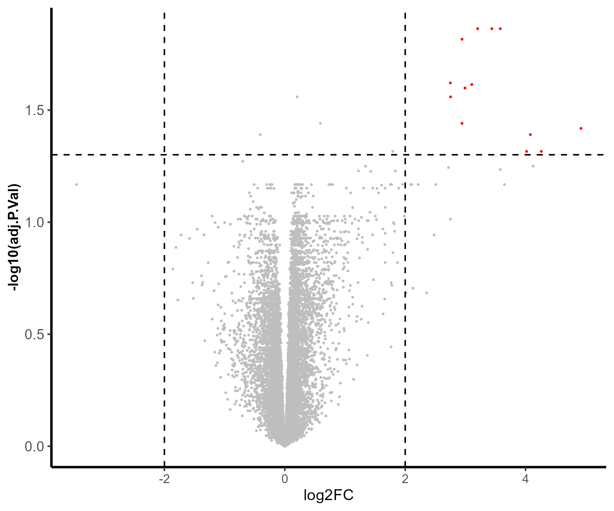


**Cortex**

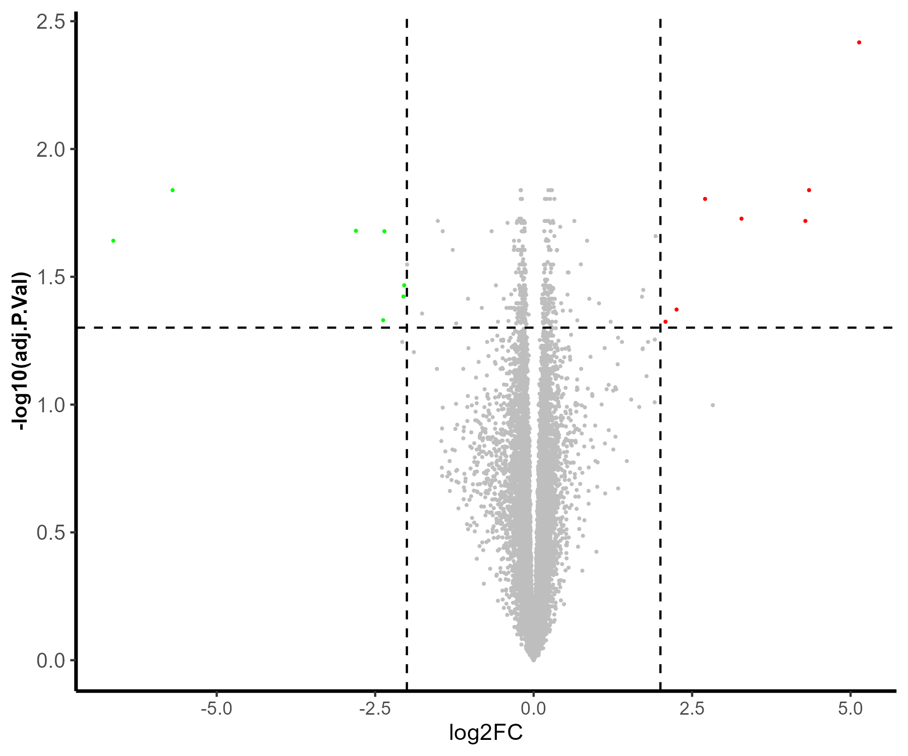


**Hippocampus**

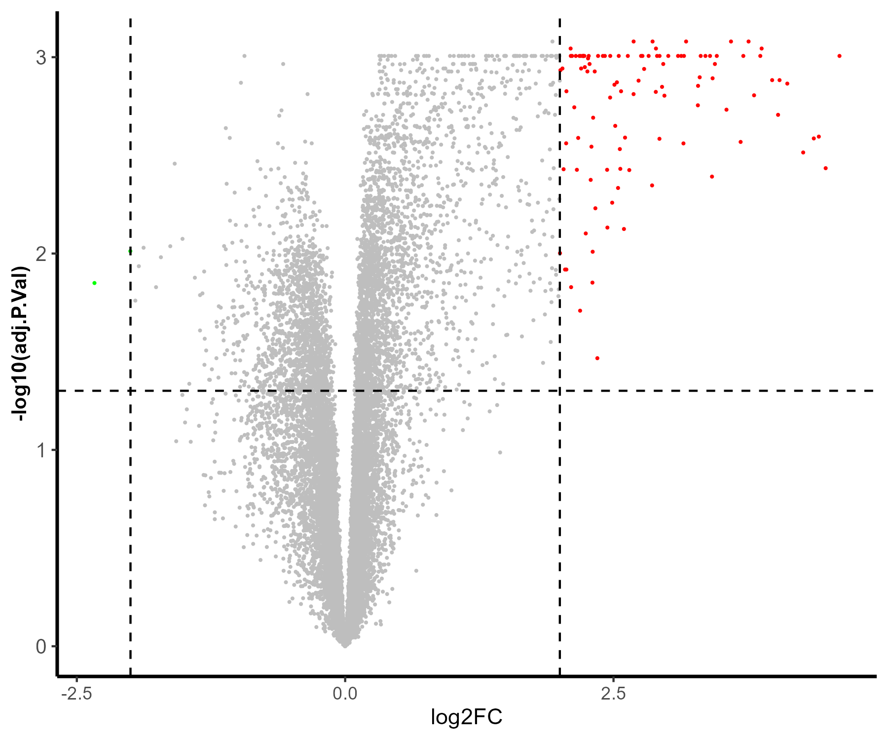


**Liver**

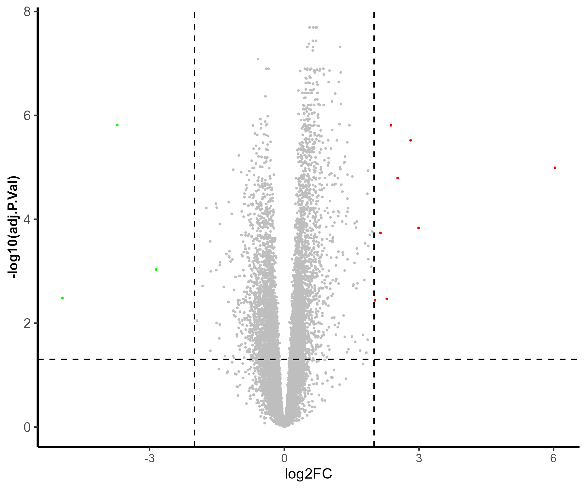

## DESeq2

### Methodology

This code defines a function to perform differential expression analysis using DESeq2. The function takes an integer count matrix and a metadata table as input, builds a design matrix including covariates (such as sex), and runs the DESeq2 pipeline. Unlike limma-voom, which transforms count data for linear modeling, and edgeR, which uses negative binomial models with different estimation procedures, DESeq2 also models count data with a negative binomial distribution but uses its own methods for normalisation and dispersion estimation. The function returns a table of differentially expressed genes between groups of interest, applying user-defined thresholds (log₂FC > 2, FDR < 0.05), and provides a summary of upregulated and downregulated genes.


```{.r .script-source}
run_DESeq2 <- function(counts_matrix, metadata, group_col = "condition", covariates = c("sex"), logFC_thresh = 2, pval_thresh = 0.05) {
  
  # Convert counts to integer (DESeq2 requirement)
  counts_matrix <- round(counts_matrix)
  storage.mode(counts_matrix) <- "integer"
  
  # Build the design formula
  design_formula <- as.formula(paste("~", group_col, "+", paste0(covariates, collapse = "+")))
  
  # Create DESeqDataSet
  dds <- DESeqDataSetFromMatrix(
    countData = counts_matrix,
    colData = metadata,
    design = design_formula
  )
  
  # Run DESeq2
  dds <- DESeq(dds)
  
  # Extract results for the main group contrast (e.g. stress vs control)
  contrast <- c(group_col, "stress", "control")
  res <- results(dds, contrast = contrast)
  res <- as.data.frame(res)
  
  # Add gene IDs as rownames (if not already)
  if (is.null(rownames(res))) rownames(res) <- rownames(counts_matrix)
  
  # Add logFC column for compatibility
  res$logFC <- res$log2FoldChange
  
  # Add significance column
  res$sig <- factor(
    ifelse(res$padj < pval_thresh & abs(res$logFC) > logFC_thresh,
           ifelse(res$logFC > logFC_thresh, "up", "down"),
           "not"),
    levels = c("up", "down", "not")
  )
  
  deg_summary <- summary(res$sig)
  
  return(list(results = res, dds = dds, deg_summary = deg_summary))
}
```

Apply the function to all the tissues.


```{.r .script-source}
# Apply the DESeq2 function to each pair of data and metadata
DESeq2_results <- map2(counts_list, metadata_list, ~ run_DESeq2(counts_matrix = .x, metadata = .y))

# Save result tables
walk2(DESeq2_results, names(DESeq2_results), ~ 
  write.csv(.x$results, file = file.path("differential_analysis/DESeq2", paste0("result_DESeq2_", .y, ".csv")), row.names = TRUE)
)
```

### Results

#### Amygdala

Top 6 rows of DESeq2 results for amygdala:


Table: (\#tab:DESeq2_amygdala)DESeq2 results for amygdala (top 6 rows)

|                   |   baseMean| log2FoldChange|     lfcSE|       stat|    pvalue|      padj|      logFC|sig |
|:------------------|----------:|--------------:|---------:|----------:|---------:|---------:|----------:|:---|
|ENSSSCG00000000002 |   18.58295|      0.1090747| 0.2806962|  0.3885864| 0.6975821| 0.9016860|  0.1090747|not |
|ENSSSCG00000000003 |  550.75668|      0.1481962| 0.0762700|  1.9430465| 0.0520105| 0.3119777|  0.1481962|not |
|ENSSSCG00000000005 |  620.30083|      0.0320247| 0.0621768|  0.5150584| 0.6065122| 0.8617177|  0.0320247|not |
|ENSSSCG00000000006 |  330.75408|     -0.0069834| 0.0952062| -0.0733506| 0.9415272| 0.9822891| -0.0069834|not |
|ENSSSCG00000000007 |  421.80793|      0.0804937| 0.1018349|  0.7904338| 0.4292745| 0.7591323|  0.0804937|not |
|ENSSSCG00000000010 | 1352.54281|      0.0014799| 0.1367087|  0.0108255| 0.9913627| 0.9976863|  0.0014799|not |

Summary of DEGs in amygdala (up/down/not):


``` script-output

  not    up 
16184    12 
```
#### Cortex

Top 6 rows of DESeq2 results for cortex:


Table: (\#tab:DESeq2_cortex)DESeq2 results for cortex (top 6 rows)

|                   |  baseMean| log2FoldChange|     lfcSE|       stat|    pvalue|      padj|      logFC|sig |
|:------------------|---------:|--------------:|---------:|----------:|---------:|---------:|----------:|:---|
|ENSSSCG00000000003 |  524.6040|     -0.0040772| 0.0848951| -0.0480262| 0.9616954| 0.9787844| -0.0040772|not |
|ENSSSCG00000000005 |  678.5726|     -0.1929807| 0.0799856| -2.4126927| 0.0158352| 0.1044043| -0.1929807|not |
|ENSSSCG00000000006 |  356.7804|     -0.0550498| 0.1157944| -0.4754098| 0.6344949| 0.7863427| -0.0550498|not |
|ENSSSCG00000000007 |  547.2443|     -0.0925411| 0.0811355| -1.1405760| 0.2540464| 0.4703198| -0.0925411|not |
|ENSSSCG00000000010 | 2338.4609|     -0.6098899| 0.2457401| -2.4818492| 0.0130703| 0.0961893| -0.6098899|not |
|ENSSSCG00000000014 |  719.0256|      0.0969554| 0.0661094|  1.4665901| 0.1424876| 0.3354712|  0.0969554|not |

Summary of DEGs in cortex (up/down/not):


``` script-output

  not 
15983 
```

#### Hippocampus

Top 6 rows of DESeq2 results for hippocampus:


Table: (\#tab:DESeq2_hippocampus)DESeq2 results for hippocampus (top 6 rows)

|                   |  baseMean| log2FoldChange|     lfcSE|       stat|    pvalue|      padj|      logFC|sig |
|:------------------|---------:|--------------:|---------:|----------:|---------:|---------:|----------:|:---|
|ENSSSCG00000000003 |  560.7572|      0.1472090| 0.0722623|  2.0371494| 0.0416351| 0.1081946|  0.1472090|not |
|ENSSSCG00000000005 |  683.9935|     -0.0342954| 0.0813476| -0.4215907| 0.6733238| 0.7756971| -0.0342954|not |
|ENSSSCG00000000006 |  326.7181|     -0.2231543| 0.1294650| -1.7236653| 0.0847683| 0.1788632| -0.2231543|not |
|ENSSSCG00000000007 |  473.9274|     -0.1831979| 0.0935225| -1.9588643| 0.0501287| 0.1229574| -0.1831979|not |
|ENSSSCG00000000010 | 1972.6162|     -0.4061736| 0.2111636| -1.9235020| 0.0544170| 0.1305618| -0.4061736|not |
|ENSSSCG00000000014 |  639.8191|      0.0029228| 0.0706021|  0.0413977| 0.9669788| 0.9794323|  0.0029228|not |

Summary of DEGs in hippocampus (up/down/not):


``` script-output

 down   not    up 
    3 15925   116 
```

#### Liver

Top 6 rows of DESeq2 results for liver:


Table: (\#tab:DESeq2_liver)DESeq2 results for liver (top 6 rows)

|                   |    baseMean| log2FoldChange|     lfcSE|       stat|    pvalue|      padj|      logFC|sig |
|:------------------|-----------:|--------------:|---------:|----------:|---------:|---------:|----------:|:---|
|ENSSSCG00000000003 |  4124.46119|      0.4984285| 0.1027084|  4.8528494| 0.0000012| 0.0000212|  0.4984285|not |
|ENSSSCG00000000005 |  3894.62173|      0.7076342| 0.1695440|  4.1737487| 0.0000300| 0.0003043|  0.7076342|not |
|ENSSSCG00000000006 |  1379.78243|      1.1114666| 0.2156778|  5.1533667| 0.0000003| 0.0000058|  1.1114666|not |
|ENSSSCG00000000007 |   340.23022|      0.1009453| 0.1086170|  0.9293697| 0.3526975| 0.4884925|  0.1009453|not |
|ENSSSCG00000000010 | 10817.93454|     -0.1616482| 0.0978577| -1.6518698| 0.0985611| 0.1858290| -0.1616482|not |
|ENSSSCG00000000014 |    95.84374|      0.0190787| 0.1131682|  0.1685875| 0.8661211| 0.9121717|  0.0190787|not |

Summary of DEGs in liver (up/down/not):


``` script-output

 down   not    up 
    4 13152     8 
```
### Volcano plots

The following volcano plots were generated for each tissue using the same volcano_plot function as for the limma-voom and edgeR analyses. The function is applied to the DESeq2 results, with the same thresholds (log₂FC > 2, padj < 0.05). Plots are saved as PNG and PDF files in differential_analysis/DESeq2/volcano_plots/, and are displayed below.


```{.r .script-source}
# Define output directory for DESeq2 volcano plots
output_dir <- "differential_analysis/DESeq2"
volcano_dir <- file.path(output_dir, "volcano_plots")
if (!dir.exists(volcano_dir)) dir.create(volcano_dir, recursive = TRUE)

# Iterate over the DESeq2 results and save each volcano plot
walk2(DESeq2_results, names(DESeq2_results), function(res, tissue) {
  df <- res$results
  # For compatibility with volcano_plot function, rename padj to adj.P.Val if necessary
  if ("padj" %in% colnames(df)) colnames(df)[colnames(df) == "padj"] <- "adj.P.Val"
  p <- volcano_plot(df, thre_logFC = 2, thre_pval = 0.05)
  # Save as PNG
  ggsave(filename = file.path(volcano_dir, paste0("volcano_", tissue, ".png")),
         plot = p, width = 6, height = 5, dpi = 300)
  # Save as PDF
  ggsave(filename = file.path(volcano_dir, paste0("volcano_", tissue, ".pdf")),
         plot = p, width = 6, height = 5)
})
```

**Amygdala**

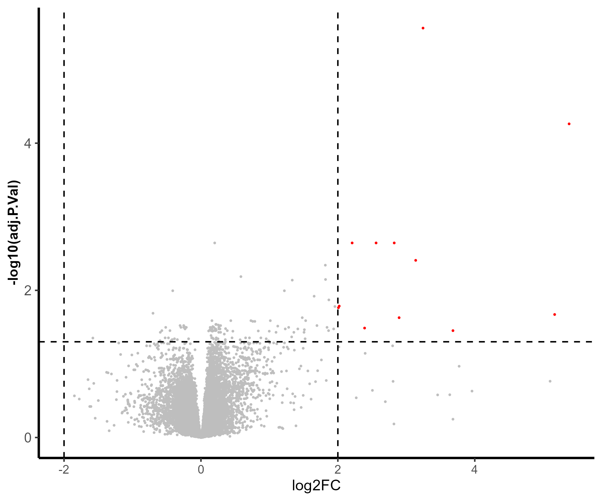


**Cortex**

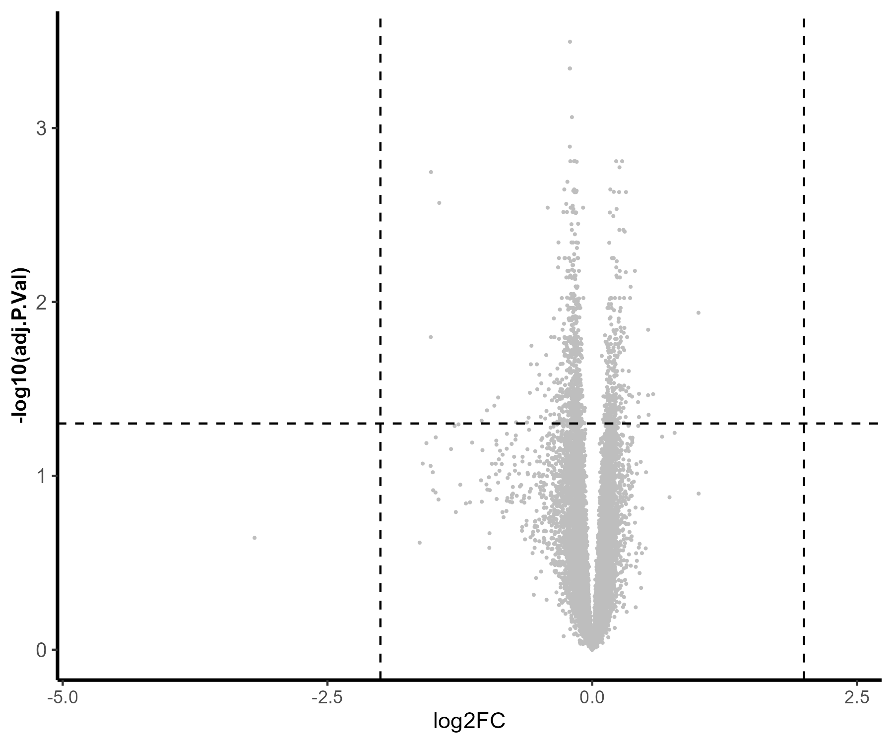


**Hippocampus**

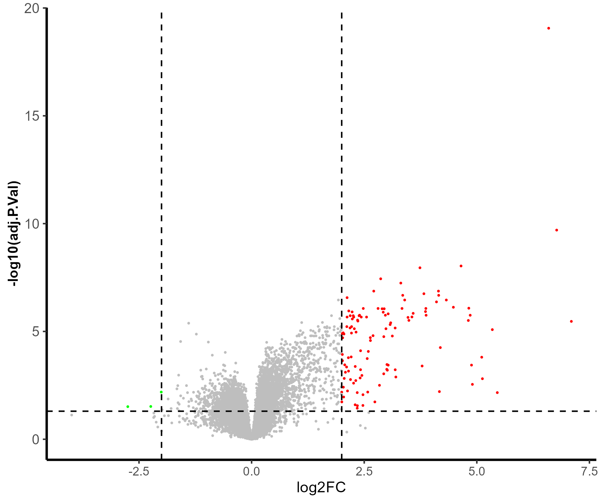


**Liver**

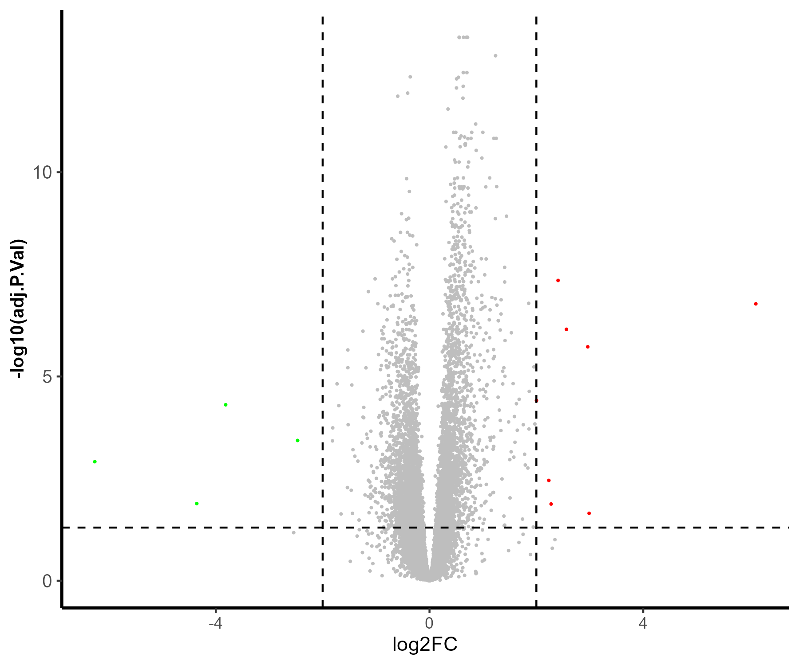

## Comparison of methods

This code defines a function to compare the differential expression results obtained from limma-voom, edgeR, and DESeq2 for each tissue. For each method, the function extracts the lists of upregulated and downregulated genes and generates Venn diagrams to visualize the overlap between methods. The resulting plots, saved in the differential_analysis/venn_diagrams/ folder, allow for a straightforward comparison of the consistency and differences in gene detection across the three differential expression analysis approaches.


```{.r .script-source}
run_venn <- function(
  limma_file, edgeR_file, DESeq2_file, 
  output_dir = "differential_analysis/venn_diagrams",
  tissue = "Tissue"
) {
  # Create output directory if it doesn't exist
  if (!dir.exists(output_dir)) dir.create(output_dir, recursive = TRUE)
  
  # Read result files
  res_limma  <- read.csv(limma_file, row.names = 1)
  res_edgeR  <- read.csv(edgeR_file, row.names = 1)
  res_DESeq2 <- read.csv(DESeq2_file, row.names = 1)
  
  for (sig_type in c("up", "down")) {
    # Remove NAs from 'sig' column in each result
    res_limma_filt  <- res_limma[!is.na(res_limma$sig), ]
    res_edgeR_filt  <- res_edgeR[!is.na(res_edgeR$sig), ]
    res_DESeq2_filt <- res_DESeq2[!is.na(res_DESeq2$sig), ]
    
    # Extract DEGs for the current type
    DEGs_limma  <- rownames(res_limma_filt)[res_limma_filt$sig == sig_type]
    DEGs_edgeR  <- rownames(res_edgeR_filt)[res_edgeR_filt$sig == sig_type]
    DEGs_DESeq2 <- rownames(res_DESeq2_filt)[res_DESeq2_filt$sig == sig_type]
    
    # Skip if all sets are empty
    if (length(DEGs_limma) == 0 & length(DEGs_edgeR) == 0 & length(DEGs_DESeq2) == 0) {
      message(paste("No", sig_type, "genes in any method for", tissue, "- skipping Venn diagram."))
      next
    }
    
    venn_list <- list(
      limma = DEGs_limma,
      edgeR = DEGs_edgeR,
      DESeq2 = DEGs_DESeq2
    )
    
    main_title <- paste(
      toupper(substring(sig_type, 1, 1)), substring(sig_type, 2),
      "-regulated DEGs overlap (", tissue, ")", sep = ""
    )
    file_name <- paste0("venn_", tolower(tissue), "_", sig_type, ".png")
    output_path <- file.path(output_dir, file_name)
    
    venn.plot <- venn.diagram(
      x = venn_list,
      filename = NULL,
      fill = c("#FF6666", "#FFFF00", "#993366"),
      alpha = 0.5,
      cex = 1.5,
      cat.cex = 1.5,
      main = main_title
    )
    
    png(output_path, width=800, height=800, res=120)
    grid.newpage()
    grid.draw(venn.plot)
    dev.off()
    
    #clean up temporary files
    tmp_files <- list.files(pattern = "^VennDiagram\\.")
    if (length(tmp_files) > 0) file.remove(tmp_files)
  }
}
```

Apply run_venn function to all the tissues:


```{.r .script-source}
# Amygdala
run_venn(
  limma_file  = "differential_analysis/limma_voom/result_limma_voom_amygdala.csv",
  edgeR_file  = "differential_analysis/edgeR/result_edgeR_amygdala.csv",
  DESeq2_file = "differential_analysis/DESeq2/result_DESeq2_amygdala.csv",
  tissue = "Amygdala"
)
# Cortex
run_venn(
  limma_file  = "differential_analysis/limma_voom/result_limma_voom_cortex.csv",
  edgeR_file  = "differential_analysis/edgeR/result_edgeR_cortex.csv",
  DESeq2_file = "differential_analysis/DESeq2/result_DESeq2_cortex.csv",
  tissue = "Cortex"
)
# Hippocampus
run_venn(
  limma_file  = "differential_analysis/limma_voom/result_limma_voom_hippocampus.csv",
  edgeR_file  = "differential_analysis/edgeR/result_edgeR_hippocampus.csv",
  DESeq2_file = "differential_analysis/DESeq2/result_DESeq2_hippocampus.csv",
  tissue = "Hippocampus"
)
# Liver
run_venn(
  limma_file  = "differential_analysis/limma_voom/result_limma_voom_liver.csv",
  edgeR_file  = "differential_analysis/edgeR/result_edgeR_liver.csv",
  DESeq2_file = "differential_analysis/DESeq2/result_DESeq2_liver.csv",
  tissue = "Liver"
)
```

### Venn diagram plots

#### Amygdala


**Amygdala – Up-regulated**

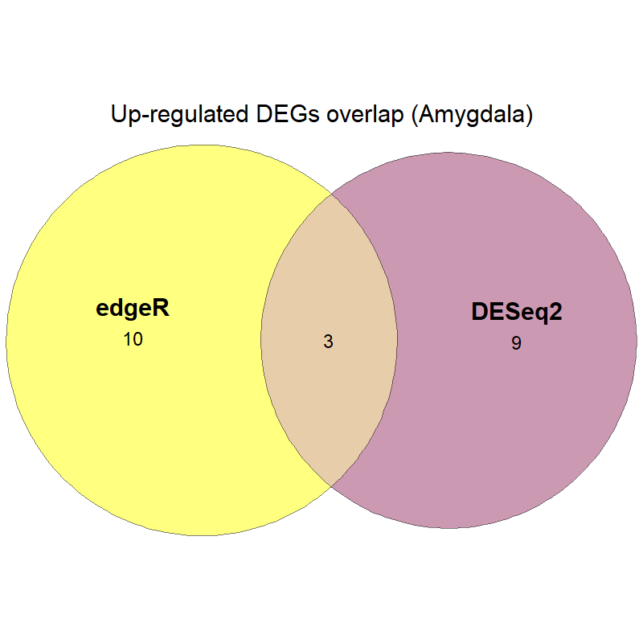


**Amygdala – Down-regulated**


#### Cortex


**Cortex – Up-regulated**

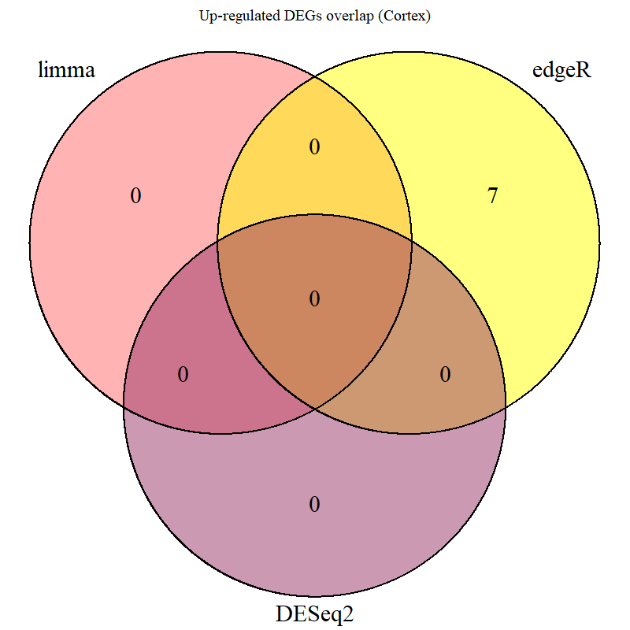


**Cortex – Down-regulated**


#### Hippocampus


**Hippocampus – Up-regulated**

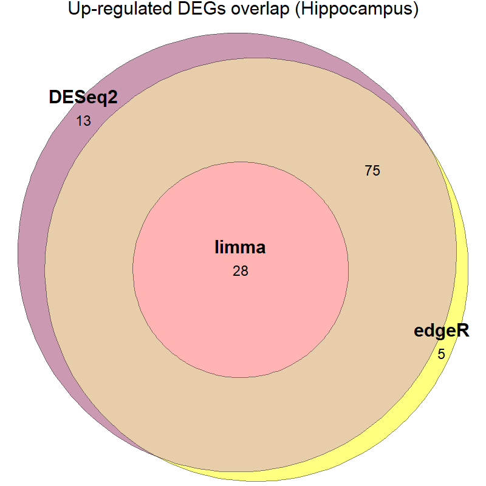


**Hippocampus – Down-regulated**

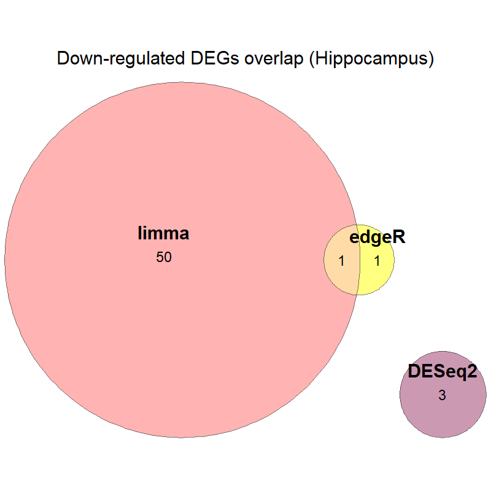
#### Liver


**Liver – Up-regulated**

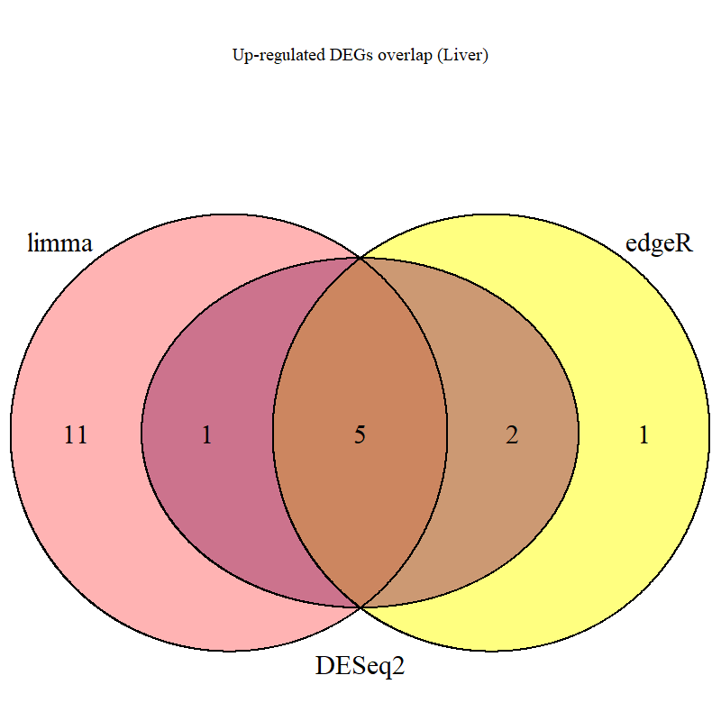


**Liver – Down-regulated**

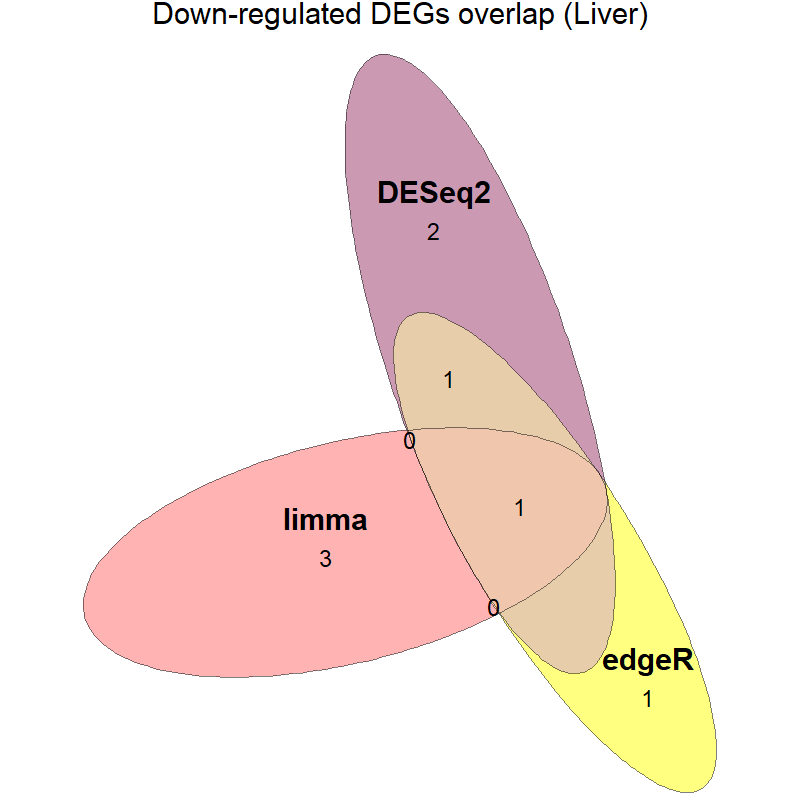


<!--chapter:end:index.Rmd-->

